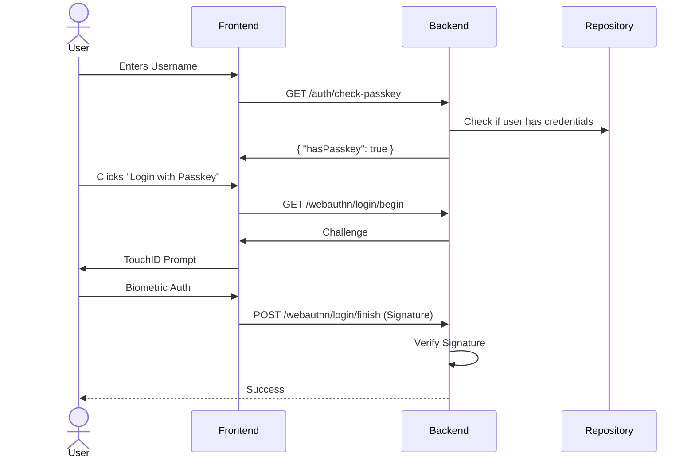
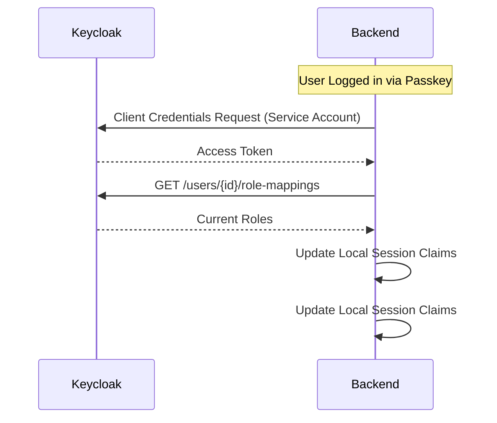
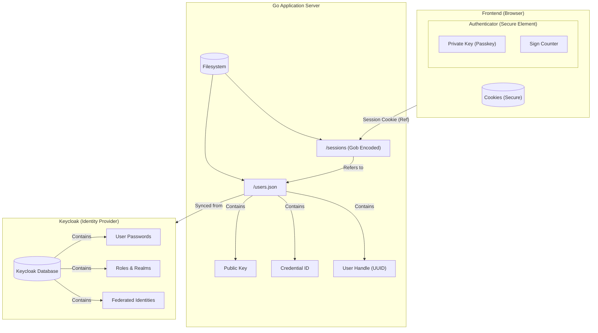

# System Architecture

## Overview
This document explains the WebAuthn (Passkey) flow implemented in the application, detailing how the Frontend, Backend, and Database interact to provide passwordless login.

## 1. Package Design (Standard Go Layout)
The application was refactored from a flat structure to a clean, component-based design:

-   **`cmd/server`**: The entry point. Initializes Config, DB, Auth providers, and starts the HTTP server.
-   **`internal/auth`**: Centralizes Authentication logic.
    -   Holds global `WebAuthn` and `OIDC` provider instances.
    -   Contains `SyncKeycloakUser` for Service Account synchronization.
-   **`internal/repository`**: Handles data persistence. Currently uses a JSON file (`users.json`) but abstracts the storage behind `GetUser`/`SaveUser` functions.
-   **`internal/handlers`**: Contains all HTTP handler logic.
    -   Uses `auth` package for logic.
    -   Uses `repository` package for data.

## 2. Authentication Flows

### A. Consumer Flow (Embedded)
-   **Password**: Standard Form POST. Validates credentials against Keycloak (Resource Owner Password Flow - ROPC).
-   **Passkey**:
    1.  **Check**: Frontend queries `/auth/check-passkey` on blur.
    2.  **Begin**: `/webauthn/login/begin` returns challenge.
    3.  **Sign**: Browser signs challenge (TouchID/FaceID).
    4.  **Finish**: `/webauthn/login/finish` verifies signature.
    5.  **Sync**: Backend calls Keycloak (Service Account) to fetch latest roles/claims.

### B. Enterprise Flow (Redirect)
-   **SSO Login**: Redirects user to Keycloak (`/sso/login` -> Keycloak -> `/callback`).
-   **Registration**: `/sso/login?action=register` triggers a special Keycloak flow (`kc_action=webauthn-register-passwordless`) to double-check identity before allowing credential registration.

## 3. Data Model
*   **Users**: Stored in `users.json`.
*   **Key**: `preferred_username` (e.g., `demo-user`).
*   **Credentials**: WebAuthn Public Keys stored inside the User record.

## 4. Sequence Diagrams

### Conditional Passkey Login

### Service Account Sync
Even when logging in with a local Passkey, we ensure enterprise security policies (roles) are applied.

## 5. Data Persistence Model

This diagram illustrates "What is stored where" across the system components.

